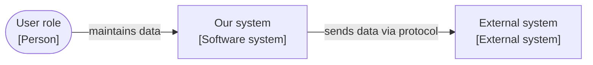

# System name

One or two sentences: what the system does and for whom.

Status: **Draft** | **Live**

## Overview

| Element | Responsibility |
|---|---|
| User role | What this person does. |
| Our system | What our system does in this context. |
| External system | What the external system does. |

## Examples

- [example-file](assets/example-file): what the file shows.

## Further documentation

- [Software Architecture Specification](software-architecture-specification.md): how the system is built (optional).
- [Software Requirements Specification](software-requirements-specification.md): what the system must do.
- [Architecture Decision Records](adr/README.md): why the system is built this way.
- [Test cases](test-cases/README.md): how the requirements are verified.