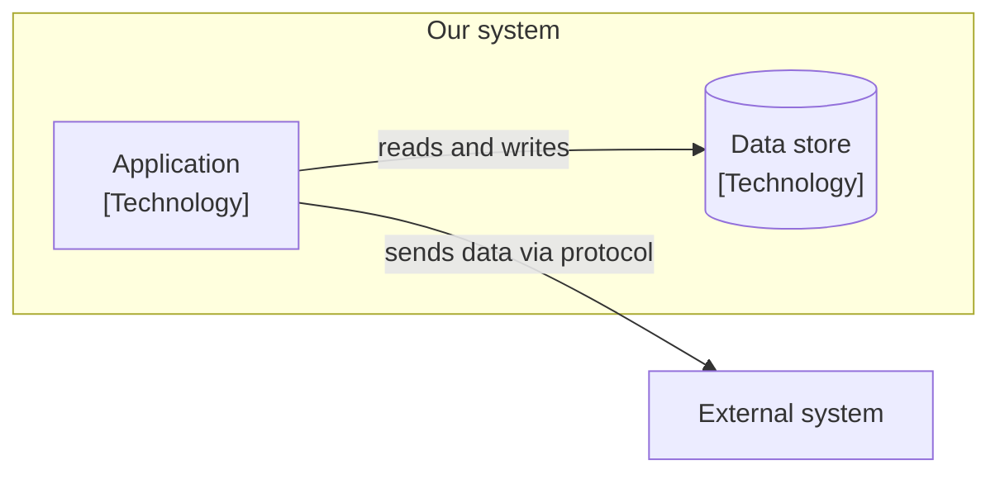
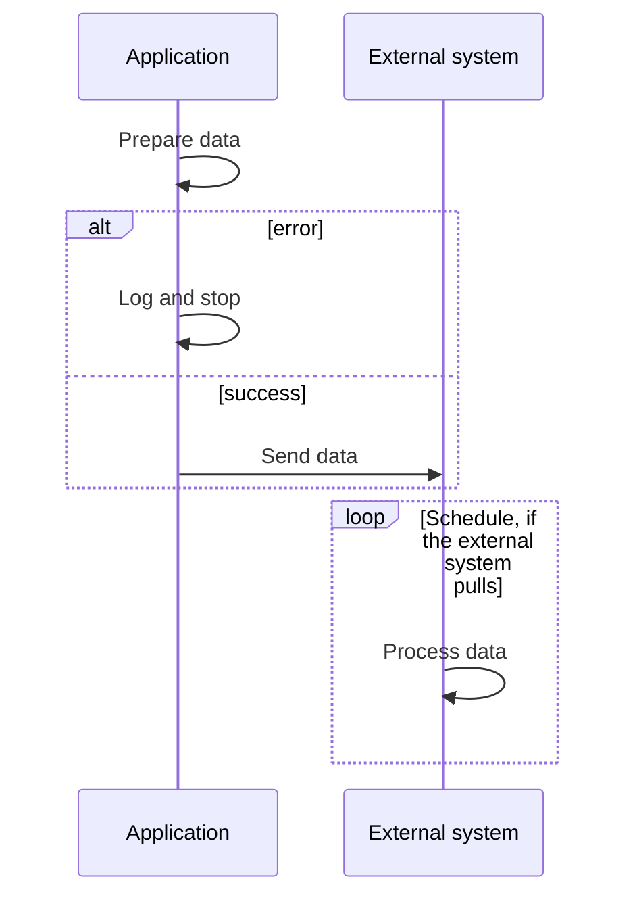

# System name Software Architecture Specification

Optional. Containers and runtime flow of the system as C4 level 2. Overview: [README](README.md). Requirements: [Software Requirements Specification](software-requirements-specification.md).

Components (C4 level 3) are documented next to the code that implements them. So they are not part of this file.

## Containers

Runnable or deployable parts: applications, services, workers, databases, file storage.

| Container | Responsibility |
|---|---|
| Application | What it does. |
| Data store | What it stores. |

## Runtime flow

The main flow, including what happens on errors.

